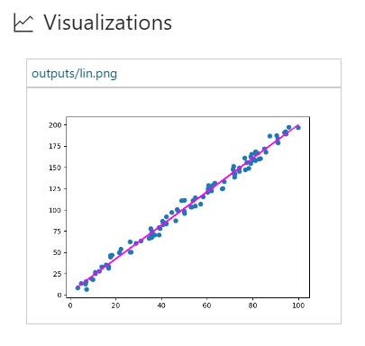

# Simple Linear Regression With Azure ML Workbench

### Author(s): Dave Voyles | [@DaveVoyles](http://www.twitter.com/DaveVoyles)
### URL: [www.DaveVoyles.com](http://www.davevoyles.com)

This sample creates a simple linear regression model form [Scikit-Learn Boston dataset.](http://scikit-learn.org/stable/modules/generated/sklearn.datasets.load_boston.html)
----------
My goal with this was create a bare-bones example of how to deploy a model to Azure from ML Workbench. I couldnt find another example which did only that. Before going any further, I'd recommend reading the [conceptual overview of Azure ML model management](https://docs.microsoft.com/en-us/azure/machine-learning/preview/model-management-overview).

## Overview
You'll need three (3) key **files** to deploy a model:
1. Your model, saved as *model.pkl*
2. A scoring script 
3. *service_schema.json* for web-service input data

This is explained in more detail in the [Deploy a model tutorial](https://docs.microsoft.com/en-us/azure/machine-learning/preview/tutorial-classifying-iris-part-3).

> To deploy the web service along with the model file, you also need a scoring script. Optionally, you need a schema for the web-service input data. The scoring script loads the model.pkl file from the current folder and uses it to produce a new result.

The gist of it is this:

The model and the scoring file upload to the storage account you created as part of the environment setup. The deployment process builds a Docker image with your model, schema, and scoring file in it, and then pushes it to the Azure container registry.

The compute environment is based on Azure Container Services. Azure Container Services provides automatic exposure of Machine Learning APIs as REST API endpoints with the following features:

* Authentication
* Load balancing
* Automatic scale-out
* Encryption

Azure Machine Learning model management uses the following information:

* Model file or a directory with the model files
* User created Python file implementing a model scoring function
* Conda dependency file listing runtime dependencies
* Runtime environment choice (spark, python, etc) 
* Schema file for API parameters

## Do I need to make all of these things myself?
That was my initial concern. When you start with the blank ML workbench project, you'll receive a folder marked *aml_config* with the config and compute dependencies you need to get a project working. The only thing you'll need to add to these are the specific libraries or dependencies your project will require. 

The model.pkl, scoring file, and service_schema.json you'll need to create.

There currently isn't any information on how to generate this *service_schema.json* file, so I copied the *service_schema.json* from the [iris classification sample](https://docs.microsoft.com/en-us/azure/machine-learning/preview/tutorial-classifying-iris-part-3#get-the-scoring-script-and-schema-files), but still have to make several changes to it. 

#### I was able to do this by:

1. Running the *iris.sklearn.py* file and setting the context to *local*
 - This will output a model.pkl file, which you can download, then place in the root directory of your current project
2. Running the *score_iris.py* file locally from ML workbench
 - The scoring file uses the model.pkl we just placed in the root directory to create a *project_schema.json*
3. Check the output section section for the *project_schema.json* file. Download and move that file to your root directory. 


This image gave me a very good understanding of how my project would be deployed:


## Logging & Printing output
TODO

## About the project

It shows how to use `matplotlib` to plot the data and the fitted line, and save a plot file (png format) to view it in the **Runs** view  in Azure Machine Learning Workbench.

Once your script is executed, you can see your plot as part of your run history in Azure ML Workbench by navigating to the **Runs** section in your project and clicking on your run. 



## Instructions for running the script from CLI window
You can run your scripts from the Workbench app. However, we use the command-line window to watch the feedback in real time.

### Running your simple linear regression script locally
Open the command-line window by clicking on **File** --> **Open Command Prompt** and install the `matplotlib` using the following command.

```
conda install matplotlib
```

Once matplotlib is installed, you can run the following command to run this sample. 

```
$ az ml experiment submit -c local linear_reg.py
```

### Running your linear regression script on local or remote Docker
If you have a Docker engine running locally, you can run `linear_reg.py` in a local docker container. Since Docker-based runs are managed by `conda_dependencies.yml` file, it needs to have a reference to the `matplotlib` library. This sample already has that reference. 

```
dependencies:
  - matplotlib
```

Run the following command for executing your script on local Docker:
```
# submit the experiment to local Docker container for execution
$ az ml experiment submit -c docker linear_reg.py
```

You can also execute your script on Docker on a remote machine. Similar to local Docker execution, `conda_dependencies.yml` needs to have the following reference:
```
dependencies:
  - matplotlib

```
If you have a compute target named _myvm_ for a remote VM, you can run the following command to execute your script:

```
$ az ml experiment submit -c myvm linear_reg.py
```

You can use this command to create a compute target.
```
$ az ml computetarget attach --name myvm --address <ip address or FQDN> --username <username> --password <pwd> --type remotedocker
```

>Note: Your first execution on docker-based compute target automatically downloads a base Docker image. For that reason, it takes a few minutes before your job starts to run. Your environment is then cached to make subsequent runs faster. 


# Resources

* [Model Management overview](https://docs.microsoft.com/en-us/azure/machine-learning/preview/model-management-overview)
* [What's new in Azure ML? Ignite 2017 [VIDEO]]()
* [Step-by-step instructions to deploy a model from ML workbench](https://www.microsoft.com/developerblog/2017/10/24/bird-detection-with-azure-ml-workbench/#depl_link)
* [VS Code extension - VS Code Tools for AI](https://marketplace.visualstudio.com/items?itemName=ms-toolsai.vscode-ai)


